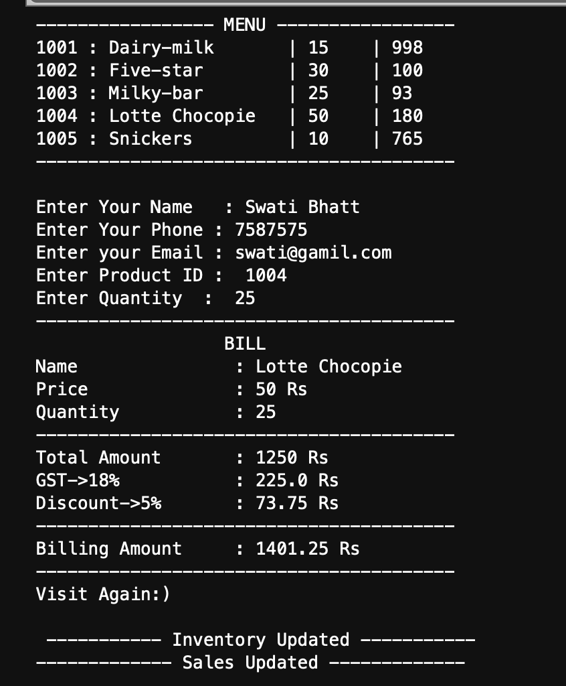

# Hey, I'm Swati Bhatt👩🏻‍💻!

# Inventory and Billing System

This is a simple inventory and billing management system implemented in Python. 
It allows users to view the product list, create bills, and automatically update inventory records.
The system also supports calculating GST and offering discounts on large purchases.


##  ☞Tech Stack Used 🖇️


##  ☞Features🧐
- **Product Menu**: Displays the list of available products with their prices and quantities.
- **Billing**: Generates bills for customers based on selected products and quantities.
- **GST Calculation**: Automatically adds 18% GST to the total amount.
- **Discounts**: Offers a 5% discount on purchases above ₹1000.
- **Stock Updates**: Automatically updates the inventory after each purchase.
- **Sales Record**: Logs all completed sales to a `sales.txt` file.

## Files

- `Records.json`: Stores the product information in a dictionary format with product IDs, names, prices, and available quantities.
- `sales.txt`: A file where all the sales transactions are logged with customer details and the final billing amount.
- `main.py`: The Python script that runs the billing and inventory system.

## How to Use

1. **Set up Inventory**:
    - Before running the script, ensure that `Records.json` contains all the products and their details.
    - Example format for `Records.json`:
      ```json
      {
        "1001": {"Name": "Laptop", "price": 45000, "quantity": 5},
        "1002": {"Name": "Headphones", "price": 1500, "quantity": 20},
        "1003": {"Name": "Smartphone", "price": 30000, "quantity": 10}
      }
      ```

2. **Run the Script**

3. **Generating a Bill**:
    - When prompted, input the following details:
        - Customer name
        - Phone number
        - Email
        - Product ID (from the displayed product menu)
        - Quantity of the product
    
    - The script will then:
        - Generate a bill, including GST and any applicable discount.
        - Update the inventory.
        - Log the transaction in `sales.txt`.

## Error Handling:
- If the requested quantity is unavailable, the system will notify the user about the available stock.
- The user will have the option to purchase the available quantity or cancel the transaction.

##  ☞Sneak Peak 🫣


##  ☞Feedback✍🏻
I’d love to hear your thoughts on this project and would really appreciate any suggestions you have. Please feel free to reach out to me at:
get.swatibhatt@gmail.com


##  ☞Contact Me 📩
[](https://swati-bhatt.github.io/Portfolio/) 
[](https://linkedin.com/in/swatibhatt153)
